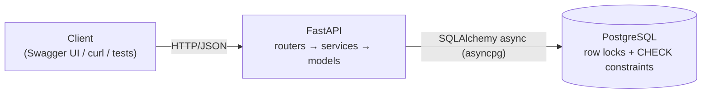
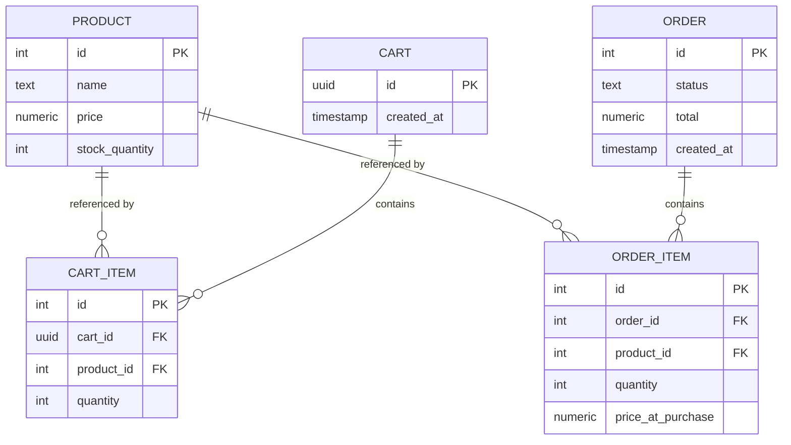

# SmartCart

A small grocery ordering API — browse products, add to a cart, check out —
built around one hard requirement: **concurrent checkouts competing for the
last units of stock must never oversell.**

Everything else exists to make that problem real. The catalog, the cart and the
order records are the smallest surface that lets two shoppers race for the same
tin of cardamom.

## Running it

```bash
docker compose up --build
```

Then open <http://localhost:8000/docs> for interactive API docs.

The API listens on 8000 and Postgres on 5432. No manual database creation, no
migration step, no seed script to remember — the catalog is seeded on startup.

## Testing

The suite needs Postgres, which compose already publishes on 5432. The
application image intentionally ships without test dependencies, so run the
suite against that database from the host:

```bash
docker compose up -d db
pip install -e ".[dev]"
pytest -v
```

The concurrency proof is `tests/test_concurrency.py`. CI runs the same suite
against a Postgres service container on every push.

## API

| Method | Path | Purpose |
|---|---|---|
| `GET`  | `/health` | Liveness. Executes `SELECT 1`, so it fails if the database link is down. |
| `GET`  | `/products` | Catalog with current stock. |
| `POST` | `/carts` | Create a cart, returns its UUID. |
| `POST` | `/carts/{cart_id}/items` | Add a product and quantity. |
| `GET`  | `/carts/{cart_id}` | Contents and server-computed total. |
| `POST` | `/carts/{cart_id}/checkout` | Place the order. |

No endpoint accepts a price. Totals are always derived from `products.price` at
read time, so a client cannot name its own price even by accident.

## Architecture

One FastAPI process, one PostgreSQL database. No cache, no queue, no worker, no
service split — the interesting problem is correctness under contention, not
scale, and every extra moving part is something to explain that hasn't earned
its place.



Three thin layers: `routers/` for HTTP shape, `services/` for the checkout
transaction, `models/` for the schema. There is no repository or unit-of-work
layer — SQLAlchemy's `AsyncSession` already is one, and wrapping it would add
indirection with a single implementation behind it.

## Data model



Four constraints carry real weight:

- `CHECK (stock_quantity >= 0)` — the invariant this project exists to protect,
  asserted by the database itself. If the application logic were wrong,
  Postgres rejects the write rather than silently overselling.
- `UNIQUE (cart_id, product_id)` — adding a product twice increments the
  existing line instead of creating a duplicate.
- `price NUMERIC(10,2)` with `Decimal` in Python — no floating point anywhere
  in the money path.
- `order_items.price_at_purchase` — an order is an immutable record of what was
  charged. A later price change must not rewrite history.

Carts are identified by an unguessable server-generated UUID. The spec required
a cart, forbade authentication, and listed no cart entity — a UUID closes that
gap without introducing accounts or cookies.

## Concurrency safety

**The race.** Two checkouts read the same stock, both decide there is enough,
both decrement. One unit gets sold twice and stock lands at 0 rather than -1 —
the corruption is invisible in the final number, which is what makes it
dangerous.

**The fix.** Checkout is one transaction built around a locking read:

```sql
SELECT id, price, stock_quantity FROM products
 WHERE id = ANY(:ids) ORDER BY id FOR UPDATE;
```

`FOR UPDATE` holds those rows until commit, so a competing checkout blocks on
the `SELECT` instead of proceeding from a stale value, and re-reads the true
stock when it wakes. Contention is confined to the product rows actually in
play; unrelated checkouts never wait on each other.

`ORDER BY id` is not cosmetic. Two multi-line orders touching the same products
in opposite order would otherwise deadlock — order 1 holds A and wants B while
order 2 holds B and wants A — and Postgres would kill one. Acquiring every lock
in a single id-ordered statement gives all transactions the same lock order, so
the cycle cannot form.

**Why this over the alternatives.** A conditional update
(`UPDATE ... SET stock = stock - n WHERE id = ? AND stock >= n`, then check the
row count) is one statement and holds its lock for less time, and it is a
genuinely good answer. But `price` has to be read anyway for
`price_at_purchase` and the server-side total, so a read happens either way —
making it the locking read costs nothing and keeps all-or-nothing multi-line
logic in one visible place instead of spread across N statements plus rollback
handling. `SERIALIZABLE` with retry gives the strongest guarantee and lets the
database do the reasoning, but it needs a retry loop, which is a second
mechanism to explain and get right for a guarantee already held.

**Insufficient stock is all-or-nothing.** One short line rejects the entire
order with 409 and decrements nothing — including the lines that would have
succeeded.

### The bug worth knowing about

The first implementation held the lock perfectly and still oversold.

The SQL was right, and a competing transaction demonstrably blocked on it. But
the cart lines were read as ORM entities, which followed a `selectin`
relationship and pulled each `Product` into the session's identity map at its
**pre-lock** stock value. SQLAlchemy then returned that already-loaded instance
rather than refreshing it from the freshly locked row, so every transaction
computed `10 - 1` and wrote `9`. Five orders, one unit decremented.

The fix is to read the cart lines as columns rather than entities, so nothing
preloads `Product`. It is a good reminder that "the SQL looks correct" is not
the same as "the invariant holds" — the ORM sat between the two.

### Proving it

`tests/test_concurrency.py` seeds a product with stock `N`, fires `M > N`
concurrent checkouts via `asyncio.gather`, and asserts exactly `N` succeed,
`M - N` return 409, and final stock is exactly 0.

The requests are genuinely concurrent: httpx's `ASGITransport` dispatches them
into one event loop and each opens its own database session, producing `M`
overlapping Postgres transactions. A synchronous `TestClient` would serialise
them and pass whether or not any locking existed.

**The test was negative-controlled.** Removing `FOR UPDATE` makes all three
concurrency tests fail. A concurrency test that passes against broken code
proves nothing, so this was checked rather than assumed.

Single-process testing is sufficient because the invariant is enforced by
Postgres row locks and a `CHECK` constraint, not by in-process coordination —
it holds identically across multiple workers or hosts.

## Deployment

`terraform/` describes an ECS Fargate + RDS deployment. It is written to be
correct and explainable but is **not applied** to a live account.

The layout mirrors `docker-compose.yml` on purpose — the task definition is the
`api` service, RDS is the `db` service — so the local stack and the cloud one
explain as a single design. The load balancer sits in public subnets; tasks and
database sit in private ones across two availability zones, which RDS subnet
groups require. Security groups chain ALB → task → database by group reference
rather than CIDR, so widening a subnet cannot accidentally widen access.

```bash
cd terraform
terraform init
terraform validate     # no AWS credentials needed
```

`terraform plan` additionally needs credentials and `TF_VAR_db_password`, since
it queries the account for availability zones. The database password is a
variable with no default so it cannot be committed; in production it would come
from Secrets Manager rather than a variable at all.

## Known gaps

Deliberate omissions, stated rather than hidden:

- **No migrations.** The schema is created at startup. Alembic is the right
  answer in production; here the schema is fixed for the life of the demo, so
  migrations would add a moving part without demonstrating anything.
- **No authentication.** Carts are identified by an unguessable UUID with no
  ownership check. Fine for a demo, not for production.
- **Stock is decremented at checkout, not reserved at cart-add.** Two carts can
  both hold the last unit and one loses at checkout. Reserving at cart-add with
  a TTL is closer to how quick-commerce actually behaves, and is the first
  thing worth changing with more time.
- **The database password reaches the task as an environment variable.** It
  should come from Secrets Manager.
- No payments, delivery, rate limiting, order history, or HA infrastructure.
