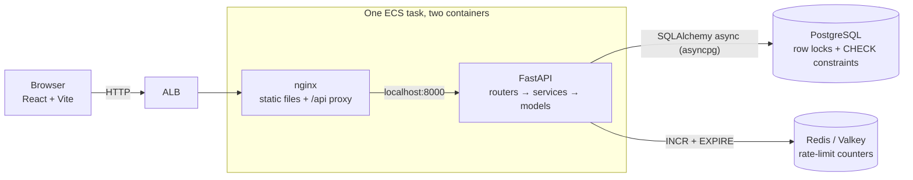
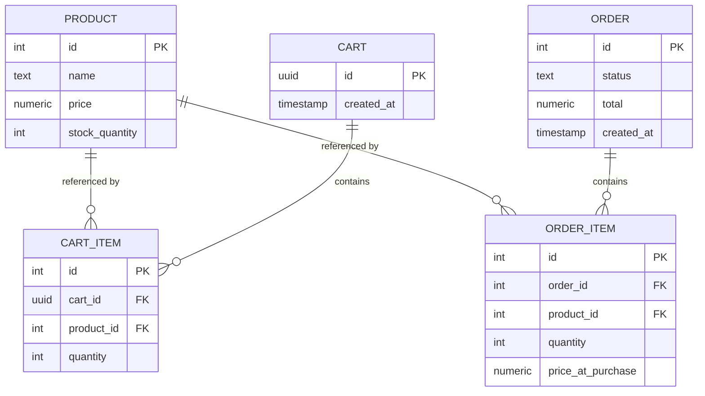

# SmartCart

A grocery ordering service — browse, add to a cart, check out — built around one
hard requirement: **concurrent checkouts competing for the last units of stock
must never oversell.**

Everything else exists to make that problem real. The catalog, the cart and the
order records are the smallest surface that lets two shoppers race for the same
tin of cardamom.

**Live at
<http://smartcart-demo-851659227.ap-south-1.elb.amazonaws.com>** — two Fargate
tasks in separate availability zones behind an ALB, sharing one RDS instance.


## Running it

```bash
docker compose up --build
```

| | |
|---|---|
| <http://localhost:3000> | The shop, including the race demo |
| <http://localhost:8000/docs> | Swagger UI, if you would rather drive the API directly |

Four containers: the API on 8000, Postgres on 5432, Redis on 6379, and nginx on
3000 serving the built frontend and proxying `/api` to the API. No manual
database creation, no migration step, no seed script to remember — the catalog
is seeded on startup.

## Testing

The suite needs Postgres, which compose publishes on 5432. The application image
intentionally ships without test dependencies, so run the suite from the host:

```bash
docker compose up -d db redis
pip install -e ".[dev]"
pytest -v
```

82 tests, about 17 seconds. The concurrency proof is `tests/test_concurrency.py`;
everything else exists to keep it honest.

CI runs the same suite against a Postgres service container on every push, and a
second job builds the images and drives the running stack end to end — so a
Dockerfile that builds but will not boot fails in CI rather than during a demo.

Configuration lives in `app/config.py`, where each setting says what it does and
what changes when it is left unset — `REDIS_URL` in particular, which decides
whether rate limits are counted per process or shared across tasks.

## API

| Method | Path | Purpose |
|---|---|---|
| `GET` | `/health` | Liveness. Executes `SELECT 1`, so it fails if the database link is down. |
| `GET` | `/products` | Catalog with current stock. |
| `GET` | `/products/{id}/recommendations` | Frequently bought together. |
| `POST` | `/carts` | Create a cart, returns its UUID. |
| `POST` | `/carts/{id}/items` | Add a product and quantity. |
| `PATCH` | `/carts/{id}/items/{product_id}` | Set a line to an exact quantity. |
| `DELETE` | `/carts/{id}/items/{product_id}` | Remove a line entirely. |
| `GET` | `/carts/{id}` | Contents and server-computed total. |
| `POST` | `/carts/{id}/checkout` | Place the order. Rate limited. |
| `GET` | `/orders`, `/orders/{id}` | Order history, newest first. |
| `GET` | `/assistant/dishes` | Dishes the assistant knows. |
| `GET` | `/assistant/shopping-list?dish=kabsa` | A dish resolved into a shopping list. |

**No endpoint accepts a price.** Totals are always derived from `products.price`
at read time, so a client cannot name its own price even by accident — the cart
input schema simply has no price field.

Adding more of a product than the shelf holds is refused with 409. That check is
a **courtesy, not a guarantee**: it reads stock without a lock, so two shoppers
can each fill a basket with the last eight units and both pass it. Checkout is
the only thing that decides. `test_the_cart_cap_does_not_prevent_two_shoppers_holding_the_last_units`
pins that, so the cap cannot quietly be mistaken for concurrency protection.

## Architecture



Two containers share one task's network namespace, so nginx reaches the API on
localhost exactly as it does by service name under compose. No service
discovery, and no path rewriting at the load balancer, which an ALB cannot do.

Inside the API, three thin layers: `routers/` for HTTP shape, `services/` for
the checkout transaction, `models/` for the schema. There is no repository or
unit-of-work layer — SQLAlchemy's `AsyncSession` already is one, and wrapping it
would add indirection with a single implementation behind it.

**Redis holds rate-limit counters and nothing else.** It is there for
correctness, not speed: the in-process limiter allowed the full limit *per task*,
so the effective limit scaled with instance count. The catalog is not cached in
Redis — it is a handful of rows Postgres already serves from its own buffer
cache, and HTTP validators remove those requests entirely rather than making
them faster.

## Data model



Four constraints carry real weight:

- `CHECK (stock_quantity >= 0)` — the invariant this project exists to protect,
  asserted by the database itself. If the application logic were wrong, Postgres
  rejects the write rather than silently overselling.
- `UNIQUE (cart_id, product_id)` — adding a product twice increments the existing
  line instead of creating a duplicate.
- `price NUMERIC(10,2)` with `Decimal` in Python — no floating point anywhere in
  the money path.
- `order_items.price_at_purchase` — an order is an immutable record of what was
  charged. A later price change must not rewrite history.

Carts are identified by an unguessable server-generated UUID. The spec required
a cart, forbade authentication, and listed no cart entity — a UUID closes that
gap without introducing accounts or cookies.

## Concurrency safety

**The race.** Two checkouts read the same stock, both decide there is enough,
both decrement. One unit gets sold twice and stock lands at 0 rather than -1 —
the corruption is invisible in the final number, which is what makes it
dangerous.

**The fix.** Checkout is one transaction built around a locking read:

```sql
SELECT id, price, stock_quantity FROM products
 WHERE id = ANY(:ids) ORDER BY id FOR UPDATE;
```

`FOR UPDATE` holds those rows until commit, so a competing checkout blocks on the
`SELECT` instead of proceeding from a stale value, and re-reads the true stock
when it wakes. Contention is confined to the product rows actually in play;
unrelated checkouts never wait on each other.

`ORDER BY id` is not cosmetic. Two multi-line orders touching the same products
in opposite order would otherwise deadlock — order 1 holds A and wants B while
order 2 holds B and wants A — and Postgres would kill one. Acquiring every lock
in a single id-ordered statement gives all transactions the same lock order, so
the cycle cannot form.

**Why this over the alternatives.** A conditional update
(`UPDATE ... SET stock = stock - n WHERE id = ? AND stock >= n`, then check the
row count) is one statement and holds its lock for less time, and it is a
genuinely good answer. But `price` has to be read anyway for `price_at_purchase`
and the server-side total, so a read happens either way — making it the locking
read costs nothing and keeps all-or-nothing multi-line logic in one visible place
instead of spread across N statements plus rollback handling. `SERIALIZABLE` with
retry gives the strongest guarantee and lets the database do the reasoning, but
it needs a retry loop, which is a second mechanism to explain and get right for a
guarantee already held.

**Insufficient stock is all-or-nothing.** One short line rejects the entire order
with 409 and decrements nothing — including the lines that would have succeeded.

### The bug worth knowing about

An early version held the lock perfectly and still oversold.

The SQL was right, and a competing transaction demonstrably blocked on it. But
something had already loaded `Product` into the session's identity map at its
**pre-lock** stock value, and SQLAlchemy returned that cached instance rather
than the freshly locked row. Every transaction computed `10 - 1` and wrote `9`.
Five orders, one unit decremented. The `CHECK` constraint never fired, because
the value written was plausible.

Two things prevent it, and **both are needed**:

- The cart lines are read as **columns, not entities**, so nothing follows a
  `selectin` relationship into `Product`. The cart existence check is a
  column-only `SELECT` for the same reason.
- The locking read carries **`populate_existing=True`**, so anything already in
  the identity map is refreshed from the locked row rather than preferred over
  it.

The second was removed once, on the reasoning that the first made it redundant.
That reasoning was wrong — `session.get(Cart, ...)` follows `selectin` from Cart
to CartItem to Product and reintroduces exactly the same staleness.

**The test suite did not catch it.** SQLAlchemy's identity map holds *weak*
references, and checkout never bound the Cart to a name, so it was usually
garbage-collected before the locking read. The bug appeared only when the object
happened to survive — it passed twelve consecutive runs of the concurrency suite
while present. Correctness contingent on garbage collection timing is not
correctness, and
`test_locked_read_ignores_anything_cached_before` now pins a live reference
deliberately so the regression cannot hide behind the weak map again.

The lesson is not "use `populate_existing`". It is that correct SQL and a
correctly held lock are still not the same as a correct invariant — the ORM sat
between the two, twice.

### Proving it

`tests/test_concurrency.py` seeds a product with stock `N`, fires `M > N`
concurrent checkouts via `asyncio.gather`, and asserts exactly `N` succeed,
`M - N` return 409, and final stock is exactly 0.

The requests are genuinely concurrent: httpx's `ASGITransport` dispatches them
into one event loop and each opens its own database session, producing `M`
overlapping Postgres transactions. A synchronous `TestClient` would serialise
them and pass whether or not any locking existed.

**The test is negative-controlled.** Removing `FOR UPDATE` makes all four
concurrency tests fail. A concurrency test that passes against broken code proves
nothing, so this is checked rather than assumed.

`ORDER BY id` has its own test: twelve concurrent multi-line orders grabbing the
same two products in opposing order all complete cleanly, where unsorted locking
would let two of them deadlock.

**And it holds across hosts, not just processes.** The same race run against the
deployed stack — two Fargate tasks in different availability zones sharing one
database — gives 8 sold from 8 units with 12 refused and final stock 0. The
guarantee lives in Postgres, not in any process's memory, so distributing the
application does not weaken it.

### Rate limiting versus the proof

The two features are in tension, and it is worth being explicit about how that
was resolved. The concurrency tests fire twenty concurrent checkouts from one
client. A per-client limit tight enough to catch that returns 429s — and a 429
looks like a *successful rejection* to an oversell assertion, so the limiter
would quietly mask the race rather than fail loudly.

So the shipped limit sits well above that burst, the rate-limit tests set their
own tight limit to prove rejection works, and the negative control was re-run
with the limiter active to confirm removing `FOR UPDATE` still fails every
concurrency test. The two are tested independently rather than one degrading the
other. In the UI a 429 gets its own muted treatment, distinct from both a sale
and a stock refusal, because it is neither.

## Deployment

`terraform/` describes the ECS Fargate + RDS stack, and it **is applied** — the
live URL above is running from it.

```bash
cd terraform
terraform init
terraform validate
```

`terraform plan` additionally needs credentials and `TF_VAR_db_password`, since
it queries the account for availability zones.

Running the race consumes stock permanently. To put the shelf back:

```bash
AWS_PROFILE=smartcart ./scripts/reset-demo-stock.sh
```

There is no admin endpoint by design and the database is not reachable from
outside the VPC, so that launches a one-off ECS task with the API container's
command overridden — reusing the deployed task definition and its injected
credentials rather than opening a door for the convenience of a demo. Order
history is left intact, since it is what the recommendations endpoint reads.

A few choices worth naming:

- **Two containers in one task, not two services.** They scale together, which
  they would anyway: adding tasks does not relieve checkout contention, because
  that queues on a Postgres row lock rather than application CPU.
- **The ALB is ingress, not load balancing.** Fargate tasks get a new IP on every
  deploy, so it provides the stable address, health checks and TLS termination.
  It is not there for throughput.
- **No NAT gateway.** It was the largest line item and existed only so
  private-subnet tasks could reach ECR and CloudWatch. Tasks run in **public**
  subnets with inbound restricted to the load balancer's security group; RDS and
  ElastiCache stay in private subnets with no route out. VPC interface endpoints
  are the textbook alternative, but four of them cost about what the NAT did.
- **ElastiCache Serverless on Valkey**, not a node. Compute scales to zero
  between demos, it provisions in about a minute rather than five to ten, and
  there is no node type or parameter group to pin. Valkey is protocol
  compatible, so the client is unchanged; serverless enforces TLS, hence
  `rediss://`.
- **The connection string lives in Secrets Manager**, injected into the container
  at start rather than sitting in the task definition where the console would
  show it.
- **The execution role policy is written out rather than managed.**
  `AmazonECSTaskExecutionRolePolicy` grants ECR and logs on `Resource "*"`; this
  stack scopes them to the two repositories, the one log group and the one secret
  it actually uses, with confused-deputy conditions on the trust policy.
- **Fargate over EC2.** The container is already the deployable artifact, and
  quick-commerce traffic is spiky — per-second billing and fast scale-out suit
  that better than an ASG's boot-time scaling. EC2 wins on sustained predictable
  load, where the per-vCPU premium adds up and Graviton with Savings Plans is
  materially cheaper.

## Known gaps

Deliberate omissions, stated rather than hidden:

- **No migrations.** The schema is created at startup. Alembic is the right
  answer in production; here the schema is fixed for the life of the demo, so
  migrations would add a moving part without demonstrating anything.
- **No authentication.** Carts are identified by an unguessable UUID with no
  ownership check. Fine for a demo, not for production.
- **Stock is decremented at checkout, not reserved at cart-add.** Two carts can
  both hold the last unit and one loses at checkout. Reserving at cart-add with a
  TTL is closer to how quick-commerce actually behaves, and is the first thing
  worth changing with more time.
- **The database password passes through Terraform state.** Inherent to
  `password` on `aws_db_instance`. The way out is `manage_master_user_password`,
  which has RDS create and rotate the secret itself so the value never reaches
  Terraform; it needs the application to assemble its URL from parts rather than
  take one string. Reaching the *container* from Secrets Manager is already done.
- **Single-AZ RDS and one NAT-free public subnet layout.** Deliberate cost
  choices for a demo. Production wants `multi_az` and private tasks.
- **Recommendations use raw co-occurrence**, so popular products look related to
  everything. Lift would fix it; not worth it without real traffic.
- **Seeded order history does not decrement stock.** Those rows represent past
  activity for the recommendations endpoint; reducing the seeded counts would
  make the concurrency demo's numbers harder to follow. Demo scaffolding, not a
  simulation.
- No payments, delivery, or HA infrastructure.
