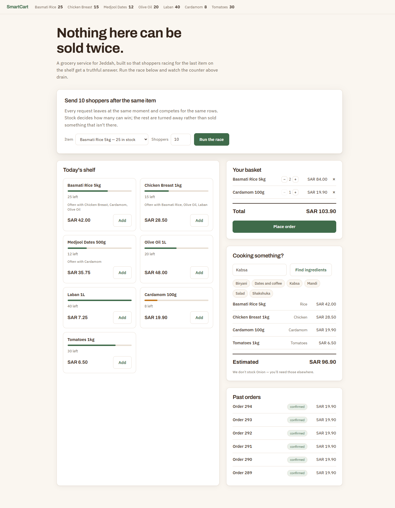
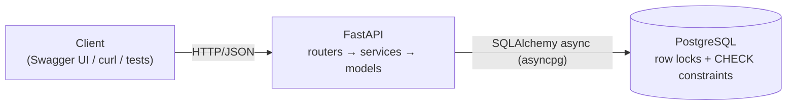
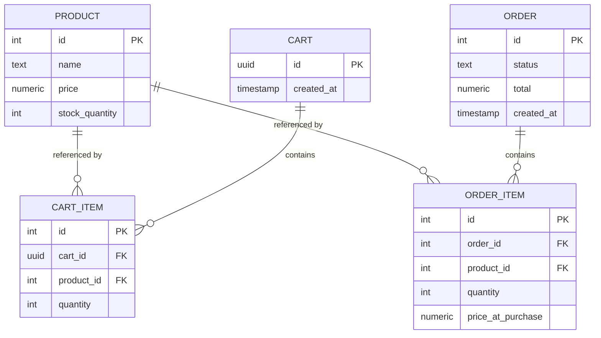

# SmartCart

A small grocery ordering API — browse products, add to a cart, check out —
built around one hard requirement: **concurrent checkouts competing for the
last units of stock must never oversell.**

Everything else exists to make that problem real. The catalog, the cart and the
order records are the smallest surface that lets two shoppers race for the same
tin of cardamom.

**Running at
<http://smartcart-demo-851659227.ap-south-1.elb.amazonaws.com>** — two Fargate
tasks in separate availability zones, behind an ALB, sharing one RDS instance.



## Running it

```bash
docker compose up --build
```

Then open <http://localhost:8000/docs> for interactive API docs.

The API listens on 8000 and Postgres on 5432. No manual database creation, no
migration step, no seed script to remember — the catalog is seeded on startup.

## Testing

The suite needs Postgres, which compose already publishes on 5432. The
application image intentionally ships without test dependencies, so run the
suite against that database from the host:

```bash
docker compose up -d db
pip install -e ".[dev]"
pytest -v
```

`.env.example` documents every setting the application reads. Copying it to
`.env` is optional — the defaults already match what compose publishes — but it
is the place to look for what is configurable, `REDIS_URL` in particular.

The concurrency proof is `tests/test_concurrency.py`. CI runs the same suite
against a Postgres service container on every push, and a second job builds the
image and drives the running stack end to end.

## API

| Method | Path | Purpose |
|---|---|---|
| `GET`  | `/health` | Liveness. Executes `SELECT 1`, so it fails if the database link is down. |
| `GET`  | `/products` | Catalog with current stock. |
| `POST` | `/carts` | Create a cart, returns its UUID. |
| `POST` | `/carts/{cart_id}/items` | Add a product and quantity. |
| `GET`  | `/carts/{cart_id}` | Contents and server-computed total. |
| `POST` | `/carts/{cart_id}/checkout` | Place the order. Rate limited. |
| `GET`  | `/orders` | Order history, newest first. |
| `GET`  | `/orders/{order_id}` | One order with its line items. |
| `GET`  | `/products/{id}/recommendations` | Frequently bought together. |
| `GET`  | `/assistant/shopping-list?dish=kabsa` | Dish resolved into a shopping list. |

No endpoint accepts a price. Totals are always derived from `products.price` at
read time, so a client cannot name its own price even by accident.

### Beyond the core

Three of these are extras built once the checkout path was finished and proven.

**Recommendations** rank products by how often they appear in the same orders,
via a self-join on `order_items`. No model, no training — the ranking is a
count you can verify by reading the order history. It inherits the usual
co-occurrence weakness, where popular products look related to everything; with
real traffic the fix is lift rather than raw count.

**The ingredient assistant** maps a dish onto catalog products through a curated
ingredient table, and reports what the catalog *cannot* supply rather than
silently dropping it. It is a lookup, deliberately: deterministic, offline, and
it cannot fail mid-demo. An LLM resolving arbitrary dishes with the catalog as
grounding would replace only where the ingredient list comes from — the matching
and the response shape would be unchanged.

**Rate limiting** on checkout is a fixed window per client, applied as a
dependency in front of the transaction so a rejected request consumes no stock.
Its default limit is set well above what the concurrency tests burst, on
purpose — see below.

## Architecture

One FastAPI process, one PostgreSQL database. No cache, no queue, no worker, no
service split — the interesting problem is correctness under contention, not
scale, and every extra moving part is something to explain that hasn't earned
its place.



Three thin layers: `routers/` for HTTP shape, `services/` for the checkout
transaction, `models/` for the schema. There is no repository or unit-of-work
layer — SQLAlchemy's `AsyncSession` already is one, and wrapping it would add
indirection with a single implementation behind it.

## Data model



Four constraints carry real weight:

- `CHECK (stock_quantity >= 0)` — the invariant this project exists to protect,
  asserted by the database itself. If the application logic were wrong,
  Postgres rejects the write rather than silently overselling.
- `UNIQUE (cart_id, product_id)` — adding a product twice increments the
  existing line instead of creating a duplicate.
- `price NUMERIC(10,2)` with `Decimal` in Python — no floating point anywhere
  in the money path.
- `order_items.price_at_purchase` — an order is an immutable record of what was
  charged. A later price change must not rewrite history.

Carts are identified by an unguessable server-generated UUID. The spec required
a cart, forbade authentication, and listed no cart entity — a UUID closes that
gap without introducing accounts or cookies.

## Concurrency safety

**The race.** Two checkouts read the same stock, both decide there is enough,
both decrement. One unit gets sold twice and stock lands at 0 rather than -1 —
the corruption is invisible in the final number, which is what makes it
dangerous.

**The fix.** Checkout is one transaction built around a locking read:

```sql
SELECT id, price, stock_quantity FROM products
 WHERE id = ANY(:ids) ORDER BY id FOR UPDATE;
```

`FOR UPDATE` holds those rows until commit, so a competing checkout blocks on
the `SELECT` instead of proceeding from a stale value, and re-reads the true
stock when it wakes. Contention is confined to the product rows actually in
play; unrelated checkouts never wait on each other.

`ORDER BY id` is not cosmetic. Two multi-line orders touching the same products
in opposite order would otherwise deadlock — order 1 holds A and wants B while
order 2 holds B and wants A — and Postgres would kill one. Acquiring every lock
in a single id-ordered statement gives all transactions the same lock order, so
the cycle cannot form.

**Why this over the alternatives.** A conditional update
(`UPDATE ... SET stock = stock - n WHERE id = ? AND stock >= n`, then check the
row count) is one statement and holds its lock for less time, and it is a
genuinely good answer. But `price` has to be read anyway for
`price_at_purchase` and the server-side total, so a read happens either way —
making it the locking read costs nothing and keeps all-or-nothing multi-line
logic in one visible place instead of spread across N statements plus rollback
handling. `SERIALIZABLE` with retry gives the strongest guarantee and lets the
database do the reasoning, but it needs a retry loop, which is a second
mechanism to explain and get right for a guarantee already held.

**Insufficient stock is all-or-nothing.** One short line rejects the entire
order with 409 and decrements nothing — including the lines that would have
succeeded.

### The bug worth knowing about

The first implementation held the lock perfectly and still oversold.

The SQL was right, and a competing transaction demonstrably blocked on it. But
the cart lines were read as ORM entities, which followed a `selectin`
relationship and pulled each `Product` into the session's identity map at its
**pre-lock** stock value. SQLAlchemy then returned that already-loaded instance
rather than refreshing it from the freshly locked row, so every transaction
computed `10 - 1` and wrote `9`. Five orders, one unit decremented.

The fix is to read the cart lines as columns rather than entities, so nothing
preloads `Product`. It is a good reminder that "the SQL looks correct" is not
the same as "the invariant holds" — the ORM sat between the two.

### Proving it

`tests/test_concurrency.py` seeds a product with stock `N`, fires `M > N`
concurrent checkouts via `asyncio.gather`, and asserts exactly `N` succeed,
`M - N` return 409, and final stock is exactly 0.

The requests are genuinely concurrent: httpx's `ASGITransport` dispatches them
into one event loop and each opens its own database session, producing `M`
overlapping Postgres transactions. A synchronous `TestClient` would serialise
them and pass whether or not any locking existed.

**The test was negative-controlled.** Removing `FOR UPDATE` makes all four
concurrency tests fail. A concurrency test that passes against broken code
proves nothing, so this was checked rather than assumed.

`ORDER BY id` has its own test: twelve concurrent multi-line orders grabbing
the same two products in opposing order all complete cleanly, where unsorted
locking would let two of them deadlock.

### Rate limiting versus the proof

The two features are in tension, and it is worth being explicit about how that
was resolved. The concurrency tests fire twenty concurrent checkouts from one
client. A per-client rate limit tight enough to catch that would return 429s —
and 429s look like *successful* rejections to an oversell assertion, so the
limiter would quietly mask the race rather than fail loudly.

So the shipped limit sits well above that burst, the rate-limit tests set their
own tight limit to prove rejection works, and the negative control was re-run
with the limiter active to confirm removing `FOR UPDATE` still fails every
concurrency test. The two are tested independently rather than one degrading
the other.

Single-process testing is sufficient because the invariant is enforced by
Postgres row locks and a `CHECK` constraint, not by in-process coordination —
it holds identically across multiple workers or hosts.

## Deployment

`terraform/` describes an ECS Fargate + RDS deployment. It is written to be
correct and explainable but is **not applied** to a live account.

The layout mirrors `docker-compose.yml` on purpose — the task definition is the
`api` service, RDS is the `db` service — so the local stack and the cloud one
explain as a single design. The load balancer sits in public subnets; tasks and
database sit in private ones across two availability zones, which RDS subnet
groups require. Security groups chain ALB → task → database by group reference
rather than CIDR, so widening a subnet cannot accidentally widen access.

```bash
cd terraform
terraform init
terraform validate     
```

`terraform plan` additionally needs credentials and `TF_VAR_db_password`, since
it queries the account for availability zones.

A few choices worth naming:

- **Two containers in one task, not two services.** They share a network
  namespace, so nginx reaches the API on localhost exactly as it does by
  service name under compose. No service discovery, and no path rewriting at
  the load balancer, which an ALB cannot do anyway.
- **No NAT gateway.** It was the largest line item and existed only so
  private-subnet tasks could reach ECR and CloudWatch. Tasks run in public
  subnets with inbound restricted to the load balancer's security group;
  the database and cache stay private with no route out. VPC interface
  endpoints are the textbook alternative but four of them cost about what the
  NAT did.
- **ElastiCache Serverless on Valkey**, not a node. Compute scales to zero
  between demos and there is no node type or parameter group to pin. Valkey
  is protocol compatible, so the client is unchanged; serverless enforces TLS,
  hence `rediss://`.
- **The connection string lives in Secrets Manager**, injected into the
  container at start rather than sitting in the task definition where the
  console would show it.
- **The execution role policy is written out rather than managed.**
  `AmazonECSTaskExecutionRolePolicy` grants ECR and logs on `Resource "*"`;
  this stack scopes them to the two repositories, the one log group and the
  one secret it actually uses.
- **`Fargate` over EC2.** The container is already the deployable artifact,
  and quick-commerce traffic is spiky — per-second billing and fast scale-out
  suit that better than an ASG's boot-time scaling. EC2 wins on sustained
  predictable load, where the per-vCPU premium adds up and Graviton with
  Savings Plans is materially cheaper.

## Known gaps

Deliberate omissions, stated rather than hidden:

- **No migrations.** The schema is created at startup. Alembic is the right
  answer in production; here the schema is fixed for the life of the demo, so
  migrations would add a moving part without demonstrating anything.
- **No authentication.** Carts are identified by an unguessable UUID with no
  ownership check. Fine for a demo, not for production.
- **Stock is decremented at checkout, not reserved at cart-add.** Two carts can
  both hold the last unit and one loses at checkout. Reserving at cart-add with
  a TTL is closer to how quick-commerce actually behaves, and is the first
  thing worth changing with more time.
- **The database password reaches the task as an environment variable.** It
  should come from Secrets Manager.
- **Rate limiting is in-memory, so it is per-process.** Two Fargate tasks would
  each allow the full limit. Production wants Redis. This contrasts usefully
  with the stock invariant, which lives in Postgres precisely so that it does
  *not* have this problem — the difference between a courtesy control and a
  correctness guarantee.
- **Seeded order history does not decrement stock.** Those rows represent past
  activity for the recommendations endpoint; reducing the seeded counts would
  make the concurrency demo's numbers harder to follow. Demo scaffolding, not a
  simulation.
- No payments, delivery, or HA infrastructure.
