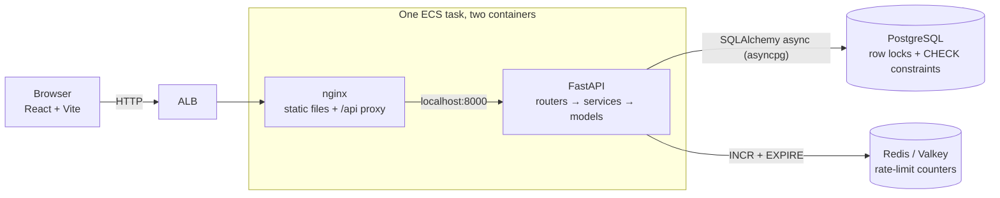
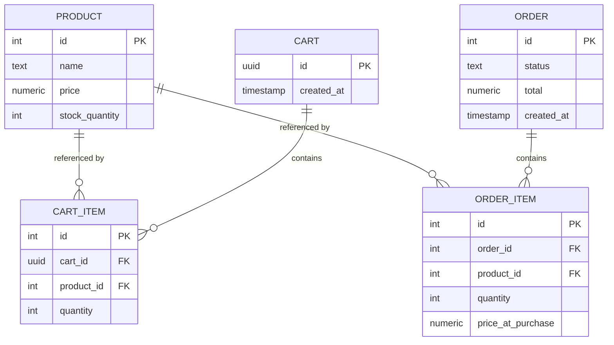

# SmartCart

[](https://github.com/musayounus/SmartCart/actions/workflows/ci.yml)


A grocery ordering service — browse, add to a cart, check out — built around one
hard requirement: **concurrent checkouts competing for the last units of stock
must never oversell.** Everything else is the smallest surface that makes that
problem real.

**Live demo:** <http://smartcart-demo-851659227.ap-south-1.elb.amazonaws.com>


## Quick start

```bash
docker compose up --build
```

| | |
|---|---|
| <http://localhost:3000> | The shop, including the race demo |
| <http://localhost:8000/docs> | Swagger UI |

Four containers — API, Postgres, Redis, and nginx serving the built frontend and
proxying `/api`. The catalog is seeded on startup; there is no migration step or
manual database setup.

## Testing

The suite needs Postgres, which compose publishes on 5432. The application image
ships without test dependencies, so run it from the host:

```bash
docker compose up -d db redis
pip install -e ".[dev]"
pytest -v            # 82 tests, ~17s
ruff check .
```

`tests/test_concurrency.py` is the one that matters. CI runs the same suite
against a Postgres service container, then builds the images and drives the
running stack end to end.

## API

| Method | Path | Purpose |
|---|---|---|
| `GET` | `/health` | Liveness — executes `SELECT 1` |
| `GET` | `/products` | Catalog with current stock |
| `GET` | `/products/{id}/recommendations` | Frequently bought together |
| `POST` | `/carts` | Create a cart, returns its UUID |
| `POST` | `/carts/{id}/items` | Add a product and quantity |
| `PATCH` | `/carts/{id}/items/{product_id}` | Set a line to an exact quantity |
| `DELETE` | `/carts/{id}/items/{product_id}` | Remove a line |
| `GET` | `/carts/{id}` | Contents and server-computed total |
| `POST` | `/carts/{id}/checkout` | Place the order (rate limited) |
| `GET` | `/orders`, `/orders/{id}` | Order history, newest first |
| `GET` | `/assistant/dishes` | Dishes the assistant knows |
| `GET` | `/assistant/shopping-list?dish=kabsa` | A dish resolved into a shopping list |

**No endpoint accepts a price.** Totals are derived from `products.price` at read
time — the cart input schema has no price field at all.

## Architecture



```
app/        FastAPI — routers/ (HTTP), services/ (logic), models.py (schema)
web/        React + Vite + TypeScript, served by nginx
terraform/  ECS Fargate, RDS, ElastiCache, ALB
tests/      82 tests; test_concurrency.py is the core proof
```

Both containers share one task's network namespace, so nginx reaches the API on
localhost exactly as it does by service name under compose. Redis holds
rate-limit counters and nothing else — it is there so the limit holds across
tasks, not for speed; the catalog is not cached in it.

## Data model



- `CHECK (stock_quantity >= 0)` — the core invariant, asserted by the database
  rather than only by application code.
- `UNIQUE (cart_id, product_id)` — adding a product twice increments the line.
- `NUMERIC(10,2)` with `Decimal` in Python — no floating point in the money path.
- `order_items.price_at_purchase` — a later price change must not rewrite history.

Carts are identified by an unguessable server-generated UUID, since the spec
required a cart but forbade authentication.

## Concurrency safety

**The race:** two checkouts read the same stock, both decide there is enough, and
both decrement. One unit is sold twice while stock lands on a plausible number.

Checkout is a single transaction built around a locking read:

```sql
SELECT id, price, stock_quantity FROM products
 WHERE id = ANY(:ids) ORDER BY id FOR UPDATE;
```

`FOR UPDATE` holds those rows until commit, so a competing checkout blocks on the
`SELECT` and re-reads the true stock when it wakes. `ORDER BY id` gives every
transaction the same lock order, so two multi-line orders touching the same
products in opposite order cannot deadlock. An insufficient line rejects the
whole order with 409 and decrements nothing.

A conditional update (`UPDATE ... WHERE stock >= n`) holds its lock for less time
and is a good answer, but `price` must be read anyway for `price_at_purchase`, so
making that read the locking read costs nothing and keeps all-or-nothing logic in
one place. `SERIALIZABLE` gives a stronger guarantee than needed at the price of
a retry loop.

Reading the cart lines as columns is necessary but **not sufficient** —
`populate_existing=True` on the locking read is load-bearing, because a `Product`
already in SQLAlchemy's identity map is otherwise preferred over the freshly
locked row. The comments in `app/services/checkout.py` explain why.

**Proof.** `tests/test_concurrency.py` fires more concurrent checkouts than there
is stock, through httpx's `ASGITransport` with `asyncio.gather`, and asserts
exactly the available number succeed and final stock is 0. It is
negative-controlled: removing `FOR UPDATE` makes all four tests fail. The same
race against the deployed stack — two Fargate tasks in different availability
zones on one database — sells 8 from 8 and refuses 12, so the guarantee holds
across hosts, not just processes.

## Deployment

`terraform/` describes the ECS Fargate + RDS stack, and it is applied — the live
URL above runs from it.

```bash
cd terraform && terraform init && terraform validate
```

`terraform plan` additionally needs credentials and `TF_VAR_db_password`.

Racing consumes stock permanently. To restore the shelf:

```bash
AWS_PROFILE=smartcart ./scripts/reset-demo-stock.sh
```

There is no admin endpoint and RDS is unreachable from outside the VPC, so that
launches a one-off ECS task with the API container's command overridden.

- **No NAT gateway** — tasks run in public subnets with inbound restricted to the
  load balancer; RDS and ElastiCache stay private with no route out.
- **The ALB is ingress, not load balancing** — Fargate task IPs change on every
  deploy, so it supplies the stable address and health checks.
- **The database URL comes from Secrets Manager**, injected at container start
  rather than sitting in the task definition.

## Limitations

Deliberate omissions, stated rather than hidden:

- **No migrations** — the schema is created at startup. Alembic in production.
- **No authentication** — carts have no ownership check.
- **Stock is decremented at checkout, not reserved at cart-add.** Reserving with
  a TTL is closer to real quick-commerce and is the first thing I would change.
- **The database password passes through Terraform state** — inherent to
  `password` on `aws_db_instance`; `manage_master_user_password` is the way out.
- **Single-AZ RDS and public-subnet tasks** — cost choices for a demo.
- **Recommendations use raw co-occurrence**, so popular products look related to
  everything.
- No payments, delivery, or HA infrastructure.
