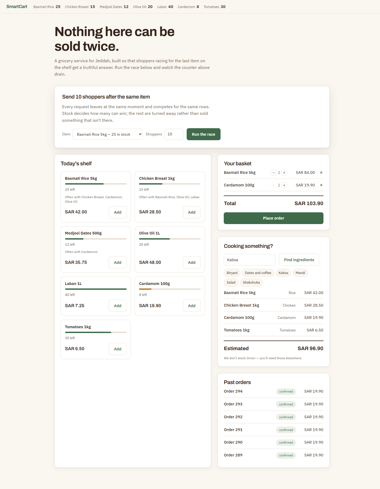
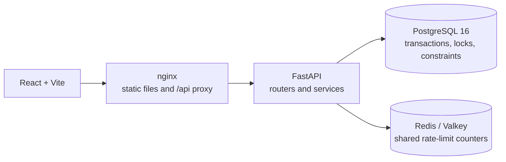

# SmartCart

[](https://github.com/musayounus/SmartCart/actions/workflows/ci.yml)


> A full-stack grocery ordering service built to answer one hard question correctly: when shoppers race for the last item, how do we guarantee that it is never sold twice?

SmartCart pairs a FastAPI/PostgreSQL API with a React race visualizer. It is deliberately small enough to explain in an interview, but treats the inventory invariant as a database correctness problem rather than a UI or in-memory coordination problem.



## What makes it interesting

- **Concurrency-safe checkout.** Competing orders lock the same product rows, re-check stock after waiting, and either commit together or fail together.
- **A visible proof, not a claim.** The browser can fire concurrent checkouts at the same shelf; successful `201`s and honest `409`s land side by side while stock reaches zero, never below it.
- **Production-shaped, demo-sized.** Docker Compose locally; Terraform for ECS Fargate, RDS PostgreSQL, Valkey, ALB, IAM, and Secrets Manager in AWS.

## Run locally

```bash
docker compose up --build
```

| URL | Purpose |
| --- | --- |
| <http://localhost:3000> | Storefront and checkout-race visualizer |
| <http://localhost:8000/docs> | FastAPI's interactive API documentation |

Compose starts the API, PostgreSQL, Redis, and nginx-served frontend. The catalog and demonstration order history seed themselves on first start.

## The concurrency guarantee

Checkout is one PostgreSQL transaction. It locks every requested product in a deterministic order before deciding whether the cart can be fulfilled:

```sql
SELECT id, price, stock_quantity
FROM products
WHERE id = ANY(:ids)
ORDER BY id
FOR UPDATE;
```

`FOR UPDATE` makes a competing checkout wait rather than act on the same stock snapshot. When it resumes, it sees the committed quantity and either succeeds or receives `409 Conflict`. `ORDER BY id` gives multi-product checkouts a shared lock order, preventing the opposite-order deadlock. The locking read also refreshes SQLAlchemy's identity map, so arithmetic cannot accidentally use a stale ORM object.

The database provides a second line of defense with `CHECK (stock_quantity >= 0)`. Orders capture `price_at_purchase`, totals use `Decimal`/`NUMERIC(10,2)`, and a short line rolls back the entire cart.

The proof is in [`tests/test_concurrency.py`](tests/test_concurrency.py): it launches overlapping HTTP checkouts with `asyncio.gather`, verifies that exactly the available stock succeeds, and exercises both insufficient-stock and multi-line lock-order cases. The suite is negative-controlled: removing the locking clause causes all four concurrency tests to fail.

## System design


```mermaid
flowchart LR
    browser[React + Vite]
    nginx["nginx<br/>static files and /api proxy"]
    api["FastAPI<br/>routers and services"]
    postgres[("PostgreSQL 16<br/>transactions, locks, constraints")]
    redis[("Redis / Valkey<br/>shared rate-limit counters")]

    browser --> nginx --> api
    api --> postgres
    api --> redis
```

| Layer | Responsibility |
| --- | --- |
| **FastAPI + SQLAlchemy async** | Catalog, carts, checkout, order history, recommendations, and ingredient lists |
| **PostgreSQL** | Source of truth for inventory, money, orders, constraints, and row locks |
| **React + TypeScript** | Shop UI plus a real browser-driven concurrency race |
| **Redis / Valkey** | Fixed-window checkout rate limits shared across application tasks |
| **Terraform + ECS Fargate** | Repeatable AWS deployment with RDS, ALB, logging, network isolation, and secrets injection |

## API at a glance

| Area | Endpoints |
| --- | --- |
| Catalog | `GET /products`, `GET /products/{id}/recommendations` |
| Carts | `POST /carts`, `GET /carts/{id}`, add/update/remove cart items |
| Checkout | `POST /carts/{id}/checkout` |
| Orders | `GET /orders`, `GET /orders/{id}` |
| Cooking assistant | `GET /assistant/dishes`, `GET /assistant/shopping-list?dish=kabsa` |

The API never accepts client-supplied prices. Cart totals are computed from the catalog, and completed orders retain the price that was actually charged.

## Quality checks

The test suite covers API contracts, database constraints, caching, rate limiting, order history, recommendations, the ingredient assistant, and the checkout race.

```bash
docker compose up -d db redis
pip install -e ".[dev]"
pytest -v                 # 82 tests
ruff check .
ruff format --check .

cd web && npm run build
cd ../terraform && terraform validate && terraform fmt -check
```

GitHub Actions runs the Python suite against PostgreSQL and separately builds and exercises the complete Compose stack end to end.

## Deploy to AWS

Terraform defines two Fargate tasks behind an ALB, with PostgreSQL on RDS and rate-limit counters in ElastiCache Serverless (Valkey). The database and cache remain private; the application is reachable only through the load balancer.

```bash
terraform -chdir=terraform init
terraform -chdir=terraform apply
AWS_PROFILE=smartcart ./scripts/deploy.sh
```

The deployment script builds and pushes both images, rolls the ECS service, waits for it to become healthy, and prints the newly created load-balancer URL. The environment is intentionally brought up only for demonstrations to avoid ongoing AWS charges.

## Deliberate boundaries

- No authentication or payment processing.
- Stock is decremented at checkout, not reserved when an item enters a cart. A production quick-commerce flow would add expiring reservations and a cleanup worker.
- Schema creation is intentionally simple for the demo; production would use Alembic migrations.
- The AWS demonstration deployment is single-AZ for RDS and HTTP-only. Production would add multi-AZ resilience, a domain, and TLS.
